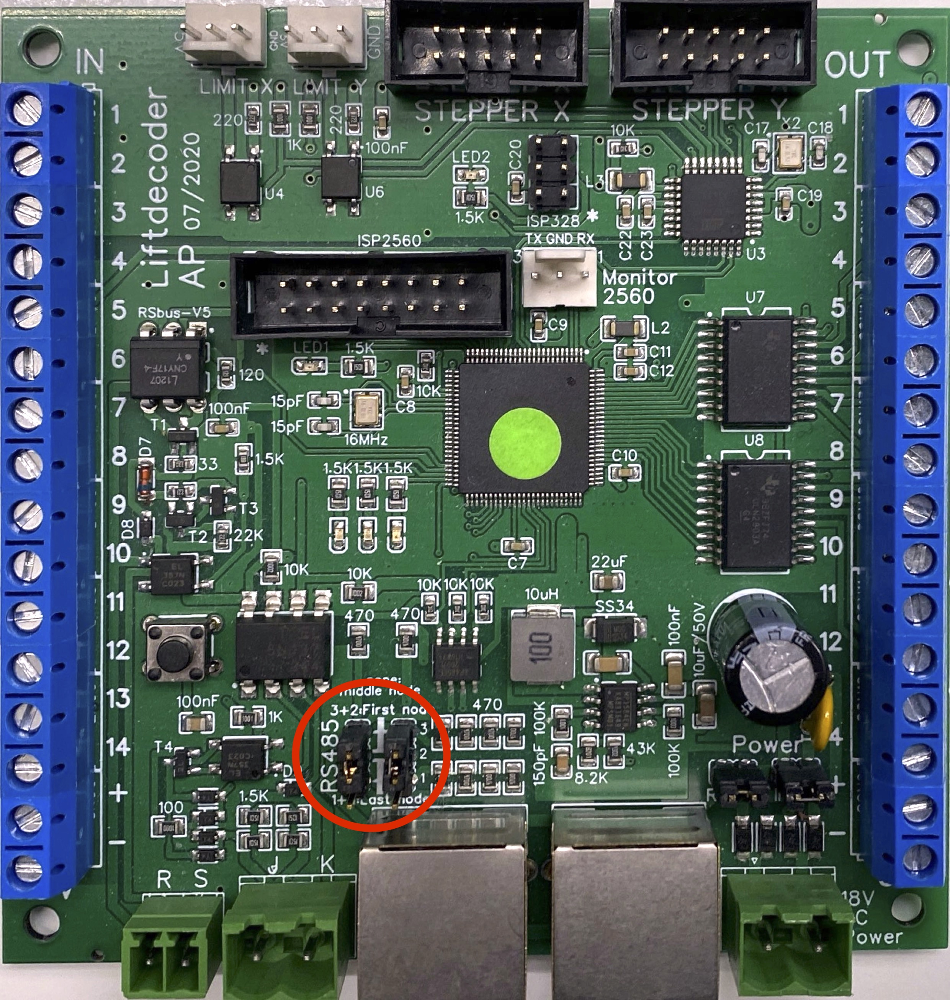
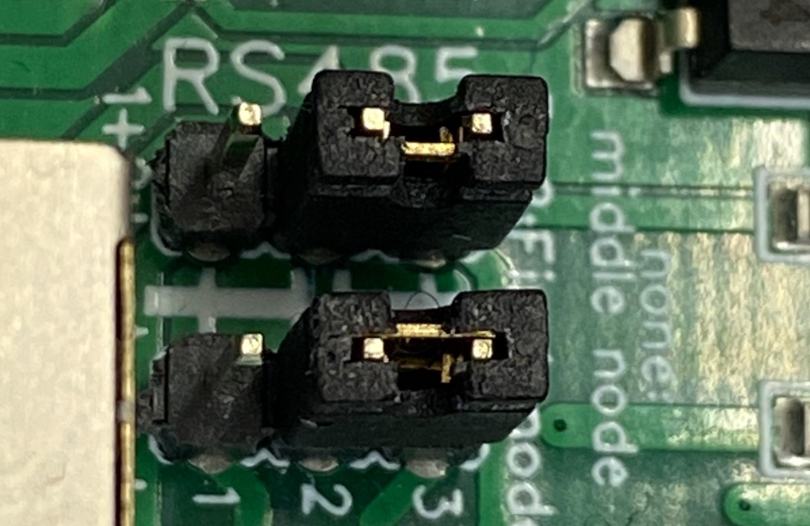
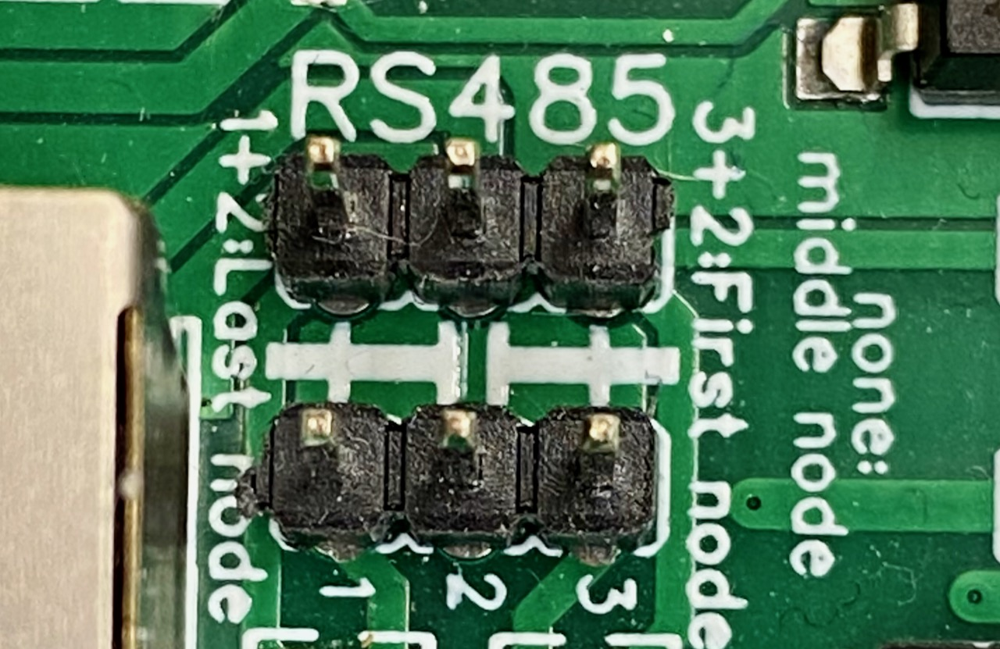
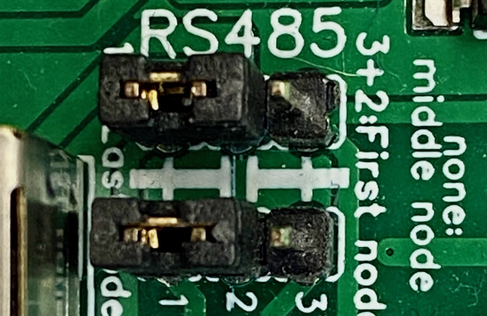
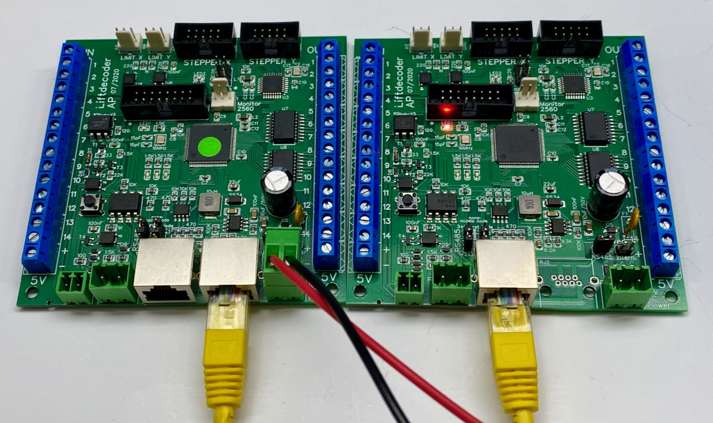

# SMD Board #

The termination and biasing resistors are already mounted on the SMD board. Depending on how the board is being used, jumpers need to be set. The location of these jumpers is shown in the figure below.

The jumpers allow the board to be configured as first, intermediate or last device on the RS485 bus. The configuration of the jumpers does not depend on the function of the board (Main, Button or IR-Sensor board).

The figures below show, from left to right, the settings as first, middle or last bus device.
<table><tr>
<td>  </td>
<td>  </td>
<td>  </td>
</tr></table>

The boards should be connected via normal network cables. Note that, next to the RS485 signal, the boards also carry power between the boards, allowing the sharing of a single power supply. 

