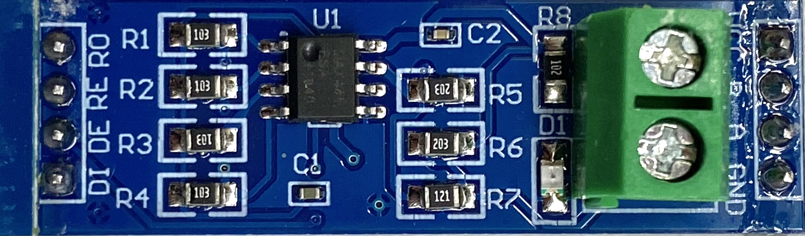
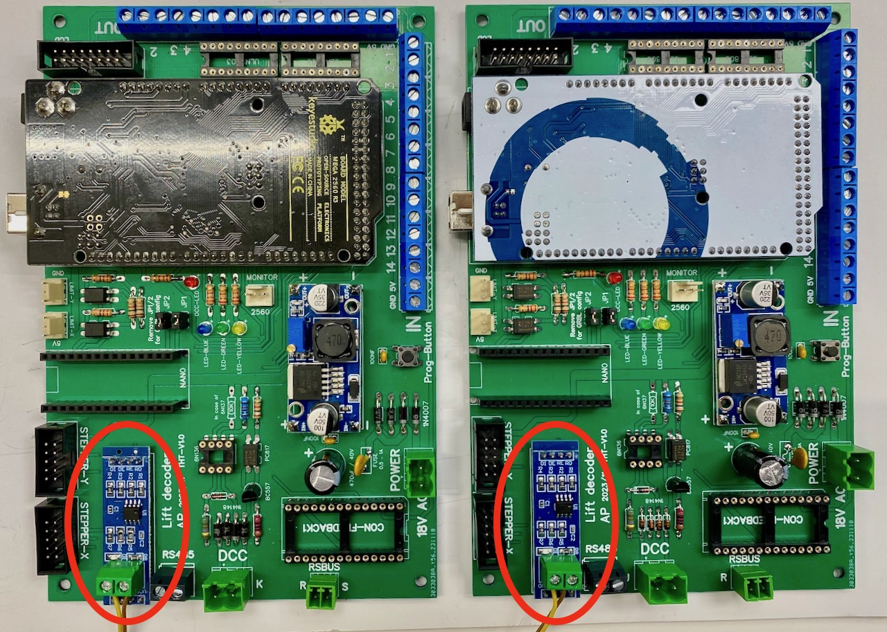
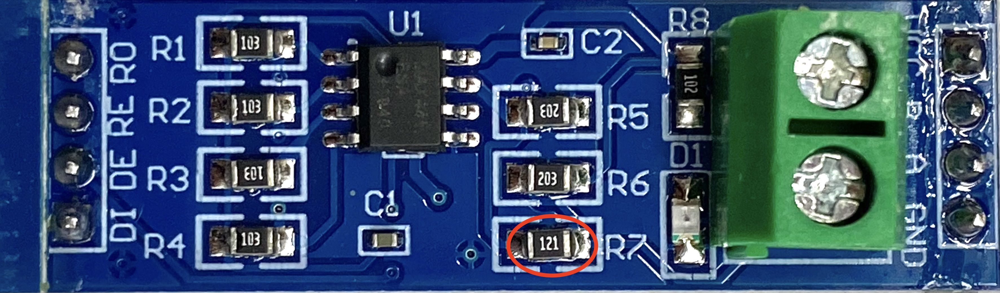
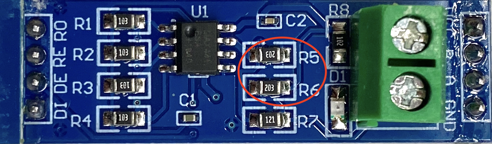
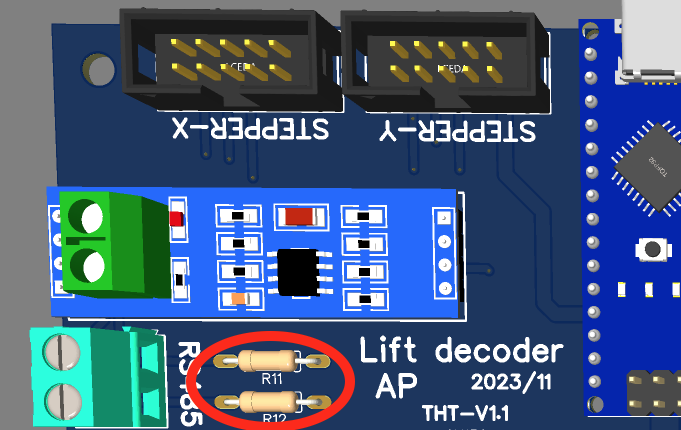

# THT Board #

For the THT board we may use cheap RS485 modules, which can be bought for far less than 1 Euro. An example of such module is shown below.

The figure below shows these modules mounted on the THT board. The two wire cable for RS485 can be connected to the green terminal connectors on the modules. To allow connection of a third module, the black terminal connector on the THT-board can be used as well.

## Termination resistor ##
The blue RS485 modules already include termination resistors of 120 Ohm, as shown in the figure below (R7, labelled 121). Whereas this is fine for the boards at the begining and end of the RS485 bus; such resistor may ***not*** be mounted on the module for the board in the middle. Therefore the resistor R7 must be removed for the middle board (Y)).

## Biasing resistors ###
As shown in the figure below, the modules also include two resistors (R5 and R6), with a value of 20 kOhm. Although one would expect that the purpose of the resistors is to "bias" the A and B lines, their value of 20kOhm is far too high to have any effect. Therefore it is necessary to add biasing resistors elsewhere, but for a single board / module only.

One option is to replace, on one of the modules, R5 and R6 by (SMD) 470 Ohm resistors. However, an easier method is to assemble these two 470 Ohm resistors on the THT Lift decoder board itself. Version 1.1 of the board has been modified to accommodate these resistors (R11 and R12, see figure below). Again, the biasing resistors may be included on a single board only.

## Further info on these modules ###
A interesting description of these modules can be found on Hackaday: [Problems with cheap Chinese RS485 modules](https://hackaday.io/project/179020-10mbps-over-1km-on-a-single-pair-of-wires/log/210449-resistors-for-rs485-ics-not-necessary)
