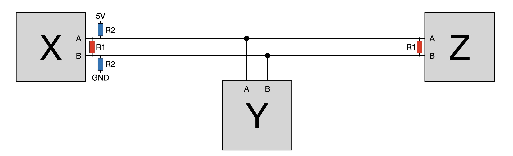

# Wiring RS485 #

RS485 is a simple and widely used communication standard, allowing multiple devices to communicate via a bus structure over a relative great distance. Only two wires (A & B) are needed for communication, although additional wires may be used for power and other purposes. Only a single device may transmit at a given time. To decide who is allowed to send, one of the devices acts as master. In digital train control environments, RS485 is, for example, used by the XPressNet (see references below).

## Wiring ##
Like any bus system, RS485 requires termination resistors at ***both ends*** if the bus. Such termination resistors limit the effect of reflections that occur at the end of the bus. The value of the resistors should match the impedance of the wires; in practice 120 Ohms may be a reasonable value.

The figure below shows these resistors labelled R1 in red. The resistors may only be installed at X and Z (both ends of the bus), and not at Y.

The figure also shows the two biasing resistors labelled R2 in blue. These resistors make sure that the A/B lines are in a "standard" state (A on, B off) if no RS485 chip is configured for output at a particular time, thus avoiding noise from floating lines [[see reference]](http://www.gammon.com.au/forum/?id=11428). In existing designs the value of these resistors may differ: OpenDCC: [1K5](https://www.opendcc.de/elektronik/opendcc/xpressnet_hw.html), Nick Gammon: [680 Ohm](http://www.gammon.com.au/forum/?id=11428), Hackaday [430 Ohm](https://hackaday.io/project/179020-10mbps-over-1km-on-a-single-pair-of-wires/log/210449-resistors-for-rs485-ics-not-necessary); in my designs I've used 470 Ohm.

The resistors R1 and R2 are already available on the SMD board, and can be activated via jumpers. See the [SMD jumper settings](SMD-board.md) page for details. Details for the [THT board can be found here](THT-board.md).

## References ##
- [Lift controller hardware - SMD board](https://oshwlab.com/aikopras/support-lift-controller)
- [Lift controller hardware - THT board](https://oshwlab.com/aikopras/lift-decoder-arduino-mega-tht)
- [SMD board: how to activate RS485](SMD-board.md)
- [THT board: how to activate RS485](THT-board.md).
- Background info: [Nick Gammon's webpages on RS485 communications](http://www.gammon.com.au/forum/?id=11428)
- Background info: [Problems with cheap Chinese RS485 modules (Hackaday)](https://hackaday.io/project/179020-10mbps-over-1km-on-a-single-pair-of-wires/log/210449-resistors-for-rs485-ics-not-necessary)
- Background info: [OpenDCC Xpressnet-Adapter](https://www.opendcc.de/elektronik/opendcc/xpressnet_hw.html)
- Background info: [Philipp Gahtow - XpressNet](https://pgahtow.de/w/XpressNet)
